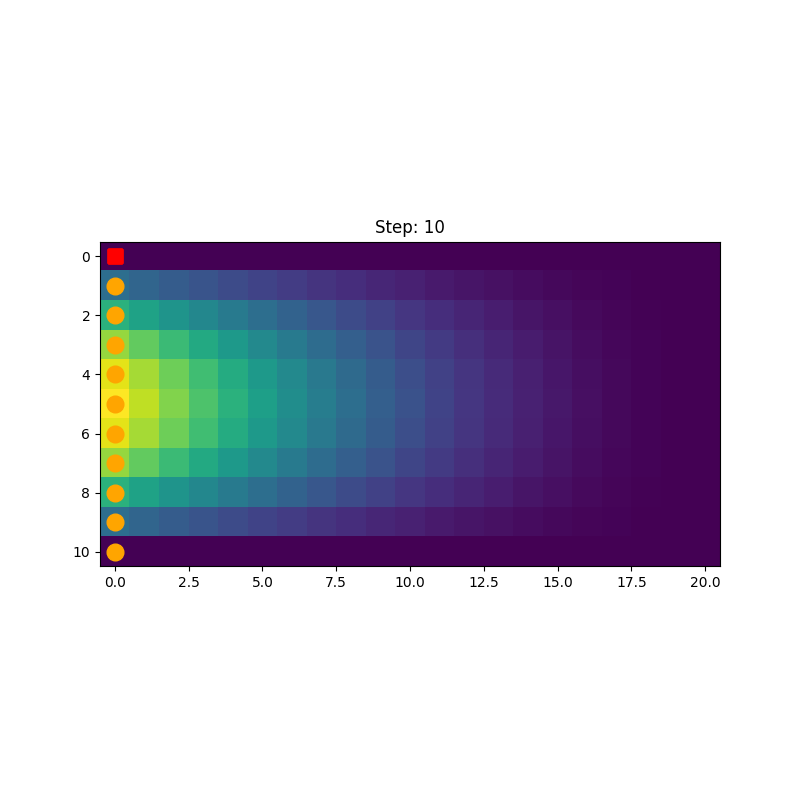
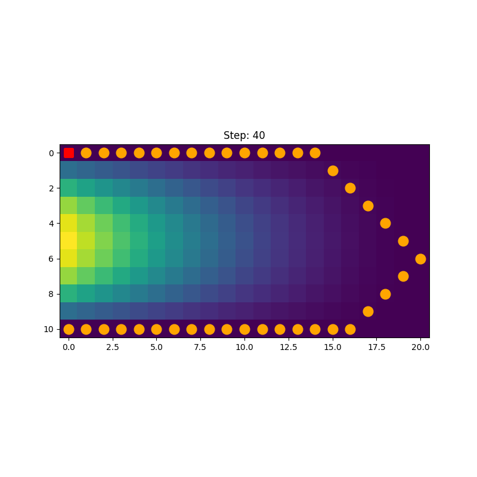
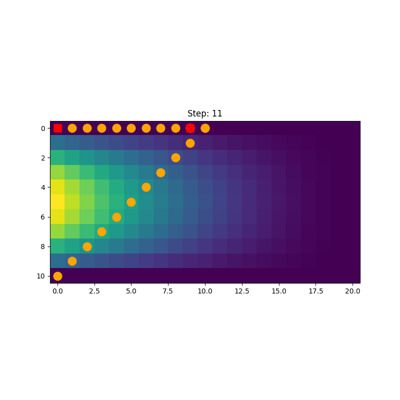

# MOO as SOO
Welcome to the Multi-Objective Optimization (MOO) with Reinforcement Learning repository! This project aims to tackle the challenges of multi-objective optimization problems by leveraging the power of single objective optimization (SOO) reinforcement learning (RL) techniques.

# Introduction
Reinforcement learning provides an alternative approach for addressing optimization problems.
Although RL has proven to be a viable approach for many optimization problems, the well-established RL algorithms are
exclusively deal with single objective optimization (SOO) problems. This imposes a signifcant restriction in
applications of RL in industry as many optimization problems are essentially multi-objective optimization (MOO)
problems.

In conventional optimization methods, dealing with multiple objectives often involves combining
them into a single objective function by assigning different weights to each objective. However,
this approach has certain disadvantegous:
- it may overlook the intricate trade-offs and complexities that arise in multi-objective
scenarios.
- for any new weights for combining the objectives, one needs to re-run the optimization procedure.

In this repo, we utilize the power of SOO RL for addressing MOO problems.

# Our approach:
Generally speaking our approach is to cast the MOO to a SOO where the optimization problem is made more general.
More precisely:
- **Augmenting the Observation:** we first cast the MOO into a SOO problem, where the weights for combining different objectives is passed to the agent
as a part of the environment's observation. This way the agent has the chance of learning the optimal action based on those weights. This can be done with a wrapper
exposes the values of the weights in the observations,
- **Covering the Relevant Paremeter Range:** we create different instances of the environment which are different from each other in the values of those weights.
the values for the weight can be chosen randomly in the range which is relevant for the business.
- **Training the agent** train the agent on those augumented environments!

# Characteristics of our approach
Characteristics of the RL-based Multi-Objective Optimization approach in this repository include:

**Adaptive Optimization**: The agent can dynamically
adjust its actions based on the observed weights, even during one episode. This is could be very interesting
for business where the weights of different objectives can change when the process is already started. The approach here allows for
**online reaction to the changes in the objective functions**! An example is shown in the "Demo" section.

**Flexibility in Objective Trade-offs**: By formulating multi-objective optimization as a reinforcement learning
problem, this approach allows for flexible trade-offs between objectives.
The agent can learn to adapt its decision-making based on the specific weights assigned to each objective, capturing the
complexities and trade-offs inherent in multi-objective scenarios.

**Pareto Front Exploration**: As the computational cost of changing the weights of the objective is much smaller than of
the similar approach with conventional
optimization techniques, the trained RL agent can be used to explores the Pareto front,
identifying non-dominated solutions that represent optimal trade-offs between objectives. This enables decision-makers to analyze and visualize a diverse set of solutions,
empowering them to make informed decisions based on their preferences. One should note that the cost of evaluating the performance of an agent is orders of magnitude smaller
than re-running a conventional optimization with a new set of weights (some references here!).

By leveraging reinforcement learning in multi-objective optimization, this repository offers a promising approach that overcomes the limitations of conventional methods, providing a more flexible, adaptive, and efficient solution for complex optimization problems with multiple objectives.

# Installation and Usage
Needs further work to be a clean code!

# Demo
For demonstration purposes, we used the simple environment of [UnevenMaze](https://github.com/nima-siboni/uneven_maze).
In this environment, an agent shall find the path to a destination while minimizing:
- **1st objective** the number of steps, and
- **2nd objective** the energy cost for the steps. The maze has an uneven terrain which leads step costs depending on the elevation changes.

This environment offers a test bed for our approach; in particular, the height profile is designed such that
the shortest path (the path with the least number of steps) is not necessarily the path with the least energy cost! This
offers an interesting situation where the agent should find different solutions (i.e. different compromises) depending on
the weights of different objectives.

An agent is trained with different step costs and height costs (which are effectively the weights of these two contributions in the combined objective function).

In the following, we demonstrate the trajectory taken by the agent depending on the unit energy cost for taking a step; This
emulate the fuel cost if our agent was a vehicle! In particular, we consider three cases:

- a case where the fuel is for free,
- a case where the fuel is as high as possible (as high as agent has seen during the training), and most interestingly,
- a case where at the beginning of the episode the fuel is as expensive as it gets, and after a number of steps
the fuel becomes cheaper and its price goes to zero.

## Zero cost fuel
The agent goes as quick as possible (effectively optimizing only 1st objective, i.e. the number of steps) toward the goal on a straight line.

This is the optimal behavior in this setup.

## Very expensive fuel
Here, we set the cost of the fuel as high as the agent has seen during the training. This should led to agent avoiding the high slopes and going straightly towards
the destination, but rather taking a detour around the high slop areas. The trained agent, at least qualitatively, shows this behavior as depicted in the figure below.

## Fuel becomes free: an online reaction to change of the objective
Here, we demonstrate one of the strength points of this approach, i.e. the adaptivity built into the agent concerning the change of different
objective weights during the episode. An example of such a situation is where the agent starts acting when the fuel has one price, but the
cost of the fuel suddenly changes to a different price and the agent should online adapt its strategy. This is the test carried out here.

In order to show the effects visibily, we change the fuel price from the highest possible value to zero in one step (at step 10)!

Interesting, the agent starts going on low slope path when the fuel is expensive but as soon as the price
changes to zero it changes the course and goes as quick as possible to the destination (which goes over the high slopes).
